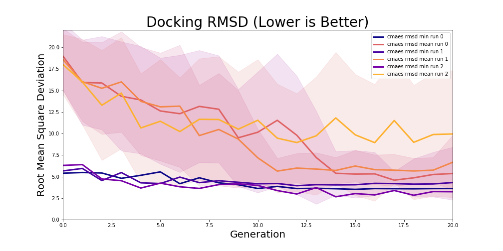

# DockRL

<div align="center">

</div>

## Setup


You'll need PyTorch, NumPy, and a protein-ligand docking simulation program called Smina, which can be downloaded from [SourceForge](https://sourceforge.net/projects/smina), to use this repository. Smina is a fork of open-source [Autodock Vina](http://vina.scripps.edu/) and has a static executable that needs to be placed in the repositories root folder. 

I am using Ubuntu 18 and `virtualenv` for virtual environment management, but other Linux distributions and/or anaconda should not be too different. To initialize and activate a new virtual environment:

```
virtualenv /env_path --python=python3
ource /env_path/bin/activate
```

DockRL uses MPI for training parallelization. In order to use `mpip4py`, you'll also need to install some dev tools.

```
sudo apt update && sudo apt install libopenmpi-dev
```

Next all you need to do is run `setup.py` to make sure your virtual environment contains dependencies and that python knows where to look for `dockrl` modules. 

```
python setup.py develop
```


## Usage


Starting a typical training run looks like this

```
python dockrl/cmaes.py -pi GraphNN -p 64 -g 100 -c 10
```

`-pi` designates the policy to use, of which there are currently 3 options. "MLP" is a simple feed forward MLP, "GraphNN" utilizes a self-attentive graph neural network, and "Params" will apply CMA-ES to the scoring function parameters directly. The flags `-p`, `-g`, and `-c` designate the population size, total number of generations, and cpu threads to utilize during CMA-ES training. Note that Smina can also take advantage of parallelism, but the flag for `exhaustiveness` must be equal to or greater than the number of cpu threads you want smina to use. That being said you may want to balance the number of threads used for CMA-ES and docking to match your machine, as each individual worker will call a seperate instance of Smina. Also remember to add 1 to the total number of CMA-ES workers to account for the mantle process that orchestrates everything.  

<div align="center">

</div>


