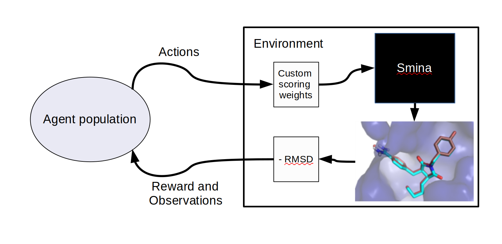

# DockRL

## Requirements

    You'll need PyTorch, NumPy, and a protein-ligand docking simulation program called Smina, which can be downloaded from [SourceForge](https://sourceforge.net/projects/smina), to use this repository. Smina is a fork of open-source [Autodock Vina](http://vina.scripps.edu/) and has a static executable that needs to be placed in the repositories root folder. 
